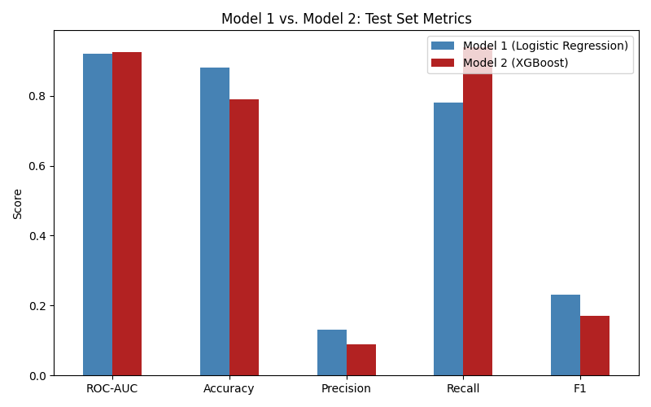

# Comparison: Model 1 (Logistic Regression) vs. Model 2 (XGBoost)

This document compares the two models' performance on the identical held-out test set, drawing on [Model1_Logistic_Regression_Performance.MD](Model1_Logistic_Regression_Performance.MD) and [Model2_XGBoost_Performance.MD](Model2_XGBoost_Performance.MD).

## File

**Notebooks:** [`src/models/model1_logistic_regression.ipynb`](../../src/models/model1_logistic_regression.ipynb), [`src/models/model2_xgboost.ipynb`](../../src/models/model2_xgboost.ipynb)

## How to Use

Both notebooks must be run first, in either order, since they train and evaluate independently on the same test set. This document synthesises their results; it does not require separate code to run.

## Side-by-Side Metrics

| Metric | Model 1 (Logistic Regression) | Model 2 (XGBoost) |
|---|---|---|
| ROC-AUC | 0.921 | **0.926** |
| Accuracy | **0.88** | 0.79 |
| Precision (positive class) | **0.13** | 0.09 |
| Recall (positive class) | 0.78 | **0.94** |
| F1-score (positive class) | 0.23 | **0.17** |

## Confusion Matrices

| | Model 1: Pred. No Loss | Model 1: Pred. Loss | Model 2: Pred. No Loss | Model 2: Pred. Loss |
|---|---|---|---|---|
| **Actual: No Loss** | 4,393 | 586 | 3,935 | 1,044 |
| **Actual: Loss** | 25 | 89 | 7 | 107 |

Model 2 catches substantially more true positives (107 vs. 89) at the cost of a higher false-positive rate (1,044 vs. 586).

## Statistical Significance Testing

**McNemar's test** was applied to the two models' binary predictions on the identical test set, testing whether their classification patterns differ significantly:

| | Model 2 Correct | Model 2 Wrong |
|---|---|---|
| **Model 1 Correct** | 4,022 | 460 |
| **Model 1 Wrong** | 20 | 591 |

The result (χ²=401.5, p<0.0001) confirms the two models' classification patterns differ significantly, not attributable to chance.

**DeLong's test** was applied to the two models' predicted probabilities, testing whether their ROC-AUC values differ significantly:

| Model | ROC-AUC |
|---|---|
| Model 1 | 0.9211 |
| Model 2 | 0.9255 |

The result (z=-1.253, p=0.210) finds no statistically significant difference between the two models' ROC-AUC values.

**Together, these results indicate the two models are comparably skilled at ranking risk overall (DeLong's), but genuinely differ in which specific cases they classify correctly at a fixed decision threshold (McNemar's).** This difference happens to favour Model 2 specifically on recall for the rare, high-cost positive class, rather than reflecting a genuine difference in overall predictive power.

## Discussion

**On raw ranking ability, the two models are close.** ROC-AUC differs by only 0.005. Model 1 achieves higher precision, accuracy, and F1, while Model 2 achieves substantially higher recall.

**This difference is directly explained by each model's hyperparameter selection process.** Model 1's Logistic Regression suffers from a 0.96 correlation between `hhi` and `top_holding_pct`; achieving a correctly-signed, interpretable `hhi` coefficient required strong regularisation (`C=0.001`), which came at a real recall cost. Model 2's tree-based structure handles this same correlation without producing an unstable coefficient, so no equivalent trade-off was necessary, allowing it to retain higher recall.

**Recommendation:** Model 2 (XGBoost) is preferred. It achieves higher recall, meaningfully more true positives caught, while still producing an interpretable, dominant concentration signal (`hhi` and `top_holding_pct` jointly accounting for ~77% of importance), without requiring Model 1's interpretability-recall trade-off. Given this study's purpose, catching genuinely at-risk portfolios before a loss occurs, Model 2's higher recall is judged more valuable than Model 1's higher precision.

## Limitations of This Comparison

- The test set's positive-class count (114 cases) means metric differences carry some sampling uncertainty; DeLong's test result (p=0.210) is consistent with this, since the ROC-AUC difference between the two models is not statistically significant.
- Neither model's hyperparameter search covered every possible configuration; further tuning may shift these results.