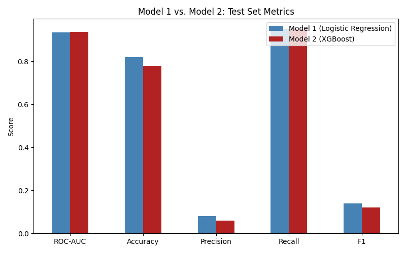

# Comparison: Model 1 (Logistic Regression) vs. Model 2 (XGBoost)

This document compares the two models' performance on the identical held-out test set, drawing on [Model1_Logistic_Regression_Performance.MD](Model1_Logistic_Regression_Performance.MD) and [Model2_XGBoost_Performance.MD](Model2_XGBoost_Performance.MD).

## File

**Notebooks:** [`src/models/model1_logistic_regression.ipynb`](../../src/models/model1_logistic_regression.ipynb), [`src/models/model2_xgboost.ipynb`](../../src/models/model2_xgboost.ipynb)

## How to Use

Both notebooks must be run first, in either order, since they train and evaluate independently on the same test set. This document synthesises their results; it does not require separate code to run.

## Side-by-Side Metrics

| Metric | Model 1 (Logistic Regression) | Model 2 (XGBoost) |
|---|---|---|
| ROC-AUC | 0.935 | **0.937** |
| Accuracy | **0.82** | 0.78 |
| Precision (positive class) | **0.08** | 0.06 |
| Recall (positive class) | 0.95 | 0.95 |
| F1-score (positive class) | **0.14** | 0.12 |

## Confusion Matrices

| | Model 1: Pred. No Loss | Model 1: Pred. Loss | Model 2: Pred. No Loss | Model 2: Pred. Loss |
|---|---|---|---|---|
| **Actual: No Loss** | 4,124 | 892 | 3,924 | 1,092 |
| **Actual: Loss** | 4 | 73 | 4 | 73 |

Both models miss the same 4 true positive cases and correctly catch the same 73. Model 2 produces 200 more false positives than Model 1 (1,092 vs. 892), consistent with its slightly lower precision.

## Discussion

**On raw predictive performance, the two models are effectively tied.** ROC-AUC differs by only 0.002, within the range of noise expected given the test set's small positive-class count (77 cases). Neither model demonstrates a decisive advantage in ranking ability. Model 1 shows marginally better precision, F1, and accuracy on this specific test set, though given the small sample, this should not be over-interpreted as a genuine, stable advantage.

**The genuinely meaningful difference between the two models lies in feature-level interpretability, not headline metrics.** Model 1's linear structure, combined with 0.96 correlation between `hhi` and `top_holding_pct`, produced an unstable, counter-intuitive negative coefficient for `hhi`, despite `hhi` being conceptually central to this study's hypothesis. Model 2, as a tree-based ensemble robust to correlated features, correctly identifies `hhi` as the single most important predictor (61% of total feature importance), directly aligning with this study's core premise and with the concentration-index-based findings in Kacperczyk, Sialm and Zheng (2005) and Yang et al. (2021), both cited in this project's literature review.

**Recommendation:** Model 2 (XGBoost) is preferred, not because it outperforms Model 1 on the metrics evaluated here, but because it produces a more correct, defensible, and literature-consistent account of *which* factors drive concentration risk, a property that matters directly for this study's practical purpose: supporting STADIOEquities' understanding of *why* a portfolio is flagged, not just *that* it is flagged.

## Limitations of This Comparison

- The test set's small positive-class count (77 cases) means metric differences between the two models carry meaningful sampling uncertainty; a small number of additional correct or incorrect predictions could shift these results.
- Neither model was extensively hyperparameter-tuned, due to time constraints (see Model1_Logistic_Regression.MD, Model2_XGBoost.MD). A tuned comparison may yield different relative performance.
- No formal statistical significance test (e.g. McNemar's test) was applied to the difference in predictions between the two models, due to time constraints; the comparison above is based on direct metric inspection.